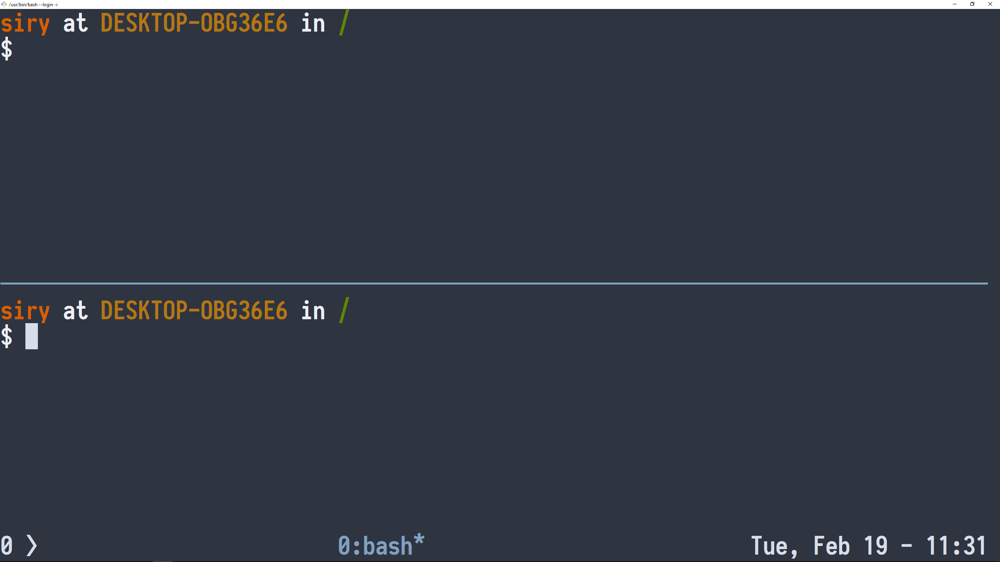
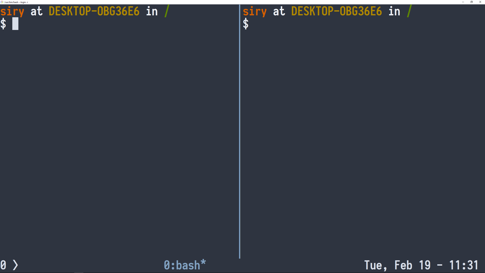
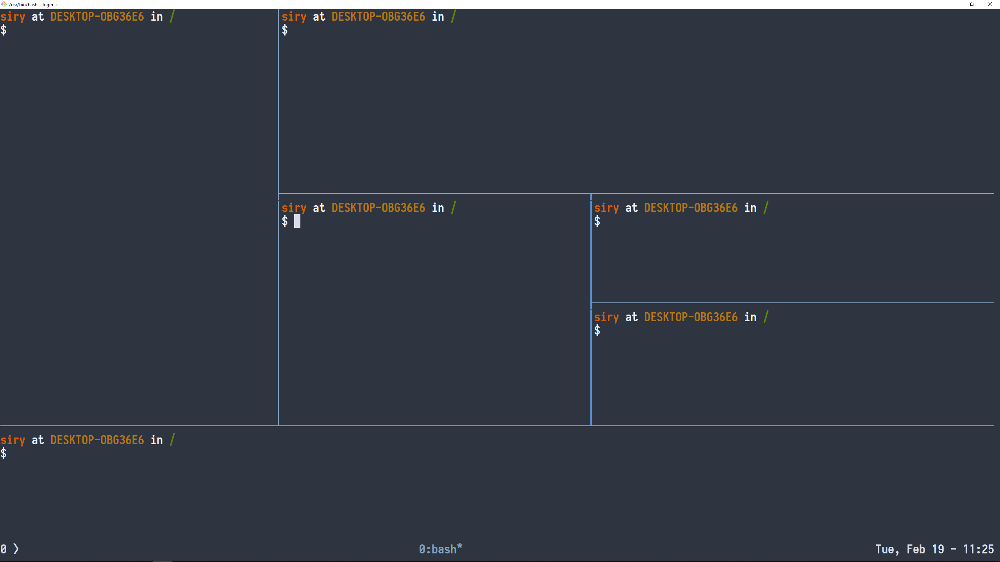
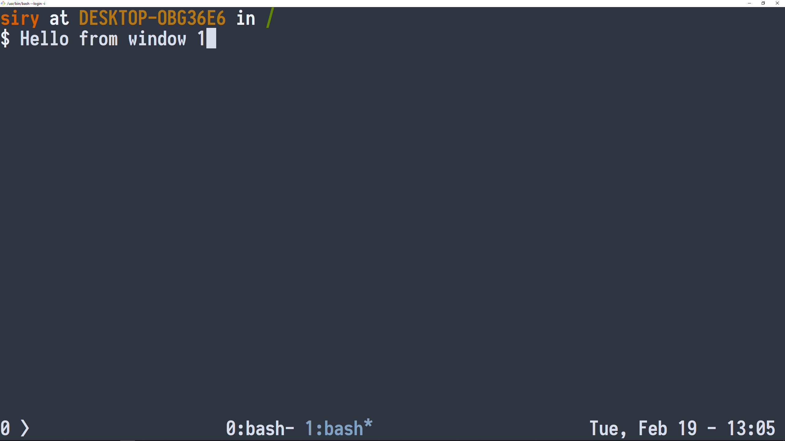
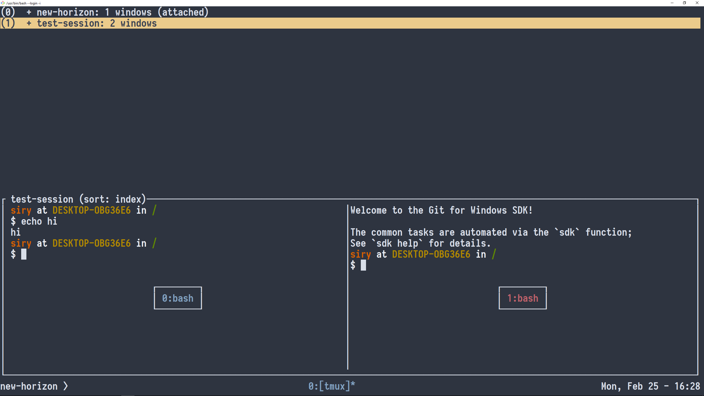

# Introduction to tmux - the terminal multiplexer #

## Installing on Windows with Git Bash ##

The easiest way is to install `tmux` on Windows is using the [git for windows sdk](https://github.com/git-for-windows/build-extra/releases) with the package manager `pacman`.

Once `git-sdk` is installed, open a terminal (usually called `git-bash.exe` in the installed directory) and write

```shell
$ pacman -S tmux
```

to install `tmux`.

## Installing on Windows Subsystem for Linux ##

Install WSL by [following the official guide](https://docs.microsoft.com/en-us/windows/wsl/install-win10). I suggest installing `Ubuntu`. Assuming you chose `Ubuntu`, start WSL and write

```shell
$ sudo apt install tmux
```

to install `tmux`.

## Getting started ##

Invoking the `tmux` command will start a new shell within the `tmux server`. You can see it as just another terminal.

### How to talk to tmux ###

In a terminal running `bash` a lot of keys have special meaning, `C-r` searches backwards, `C-e` goes to the end of the line etc. Adding a few hundred more commands that `tmux` would listen to would surely result in a clash. To circumvent this problem, `tmux` uses its own `namespace`, much like we do in other programming languages. Only here it's called the `prefix`. `Tmux` does not listen to any keypress, until the `prefix` is pressed, and then it listens to **one** combination. The default `prefix` is `C-b` (holding `Ctrl` and pressing `b`) but using the config provided by this repository, it is `C-a` (I have short fingers).

### Installing config from this repository ###

`Tmux` reads the config file `.tmux.conf` in you `$HOME` direcotory (to get there, type `cd` with no argument). If no `$HOME/.tmux.conf` is provided, it uses the system defaults. To install my sample config clone the repo and copy it over write

**TODO**: change the url
```shell
$ git clone ... && cd tmux-intro
$ cp .tmux.conf $HOME/.tmux.conf
```

I have commented to the best of my ability and you should be able to read most if not everything in that file.

From here on, all shortcuts will be shown using the provided `.tmux.conf`, if you want to use the default you can [read an online cheatsheet](https://tmuxcheatsheet.com) and use the rest of this document as a reference for what you can do.

### Multiple panes ###

What you see when you start `tmux` is called a `pane` (where you type), running inside a `window` (the container surrounding the pane). It wouldn't be a great container if you couldn't put multiple stuff in it, to split the window in half you type `prefix + -` (holding `Ctrl` followed by an `a`, releasing and pressing `-`) for horizontal and `prefix + |` for vertical.

Two panes split horizontally                                                     | Two panes split vertically
:-------------------------------------------------------------------------------:|:--------------------------------------------------------------------------:
 | 

Or you can combine the two to create whatever monstrosity you'd like:



To navigate between different panes you use `prefix + {arrow keys}` or if you're familiar with `vim` you can use `C-{hjkl}` (without the `prefix`) instead of the arrow keys.

### Multiple windows ###

You can of course have many windows next to each other. Create a new window by pressing `prefix + c`:



Where the current window is marked by postfixing a `*` as in `1:bash*`. To go to the next window you can press `prefix + n` and for previous `prefix + p`. You can also do `prefix + {window number}`.

### Multiple sessions ###

What you have been working in until now is called a `session`. A `session` is a collection of `windows`, just as a `window` is a collection of `panes`. You can detach from the current `session` by typing `prefix + d`. This will get you back to your original prompt with the message

```shell
[detached (from session 0)]
```

`0` here is the `session` name. Reattach by typing

```shell
$ tmux attach
```

And you're right back where you started! Now detach again and run

```shell
$ tmux new -s test-session
```

This will create a session called `test-session` that will be started in the current directory. Create some panes and some windows in this session. Detach from the session by pressing `prefix + C-d`.

Now create a new session called `new-horizon`:

```shell
$ tmux new -s new-horizon
```

From within the session `new-horizon` type `prefix + s` to see all the running `sessions`, and you can then choose from them with `vim`-keys (`hjkl`) or standard arrowkeys.



This is how you would separate your projects! The great thing about `tmux` is that when you detach from a session, that session keeps going in the background. This is great if you have a service running for longer than you care to look. It is common to have a `tmux` server running on a remote server, so that when you `ssh` into that server, everything is as you left it.
